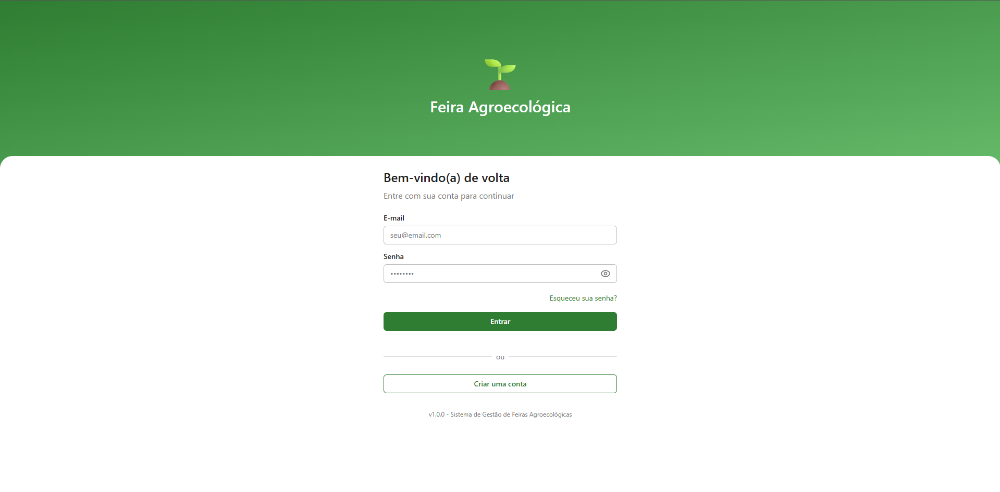
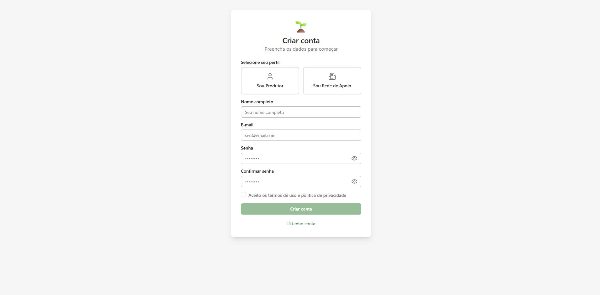
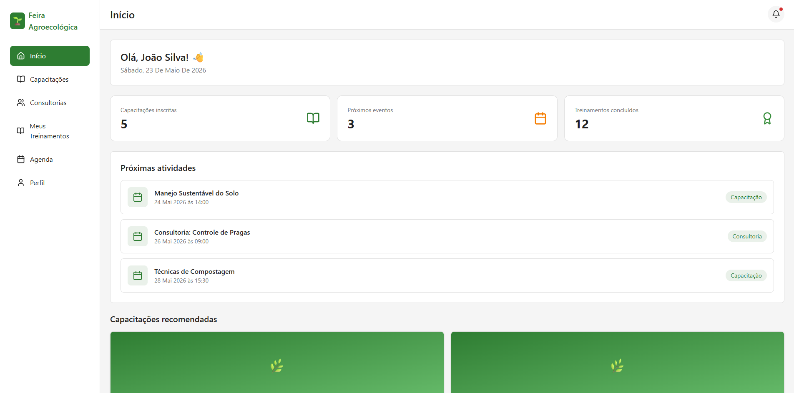
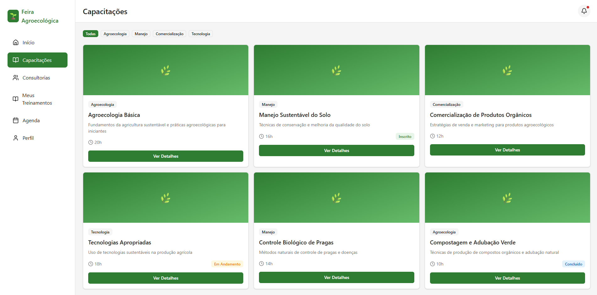
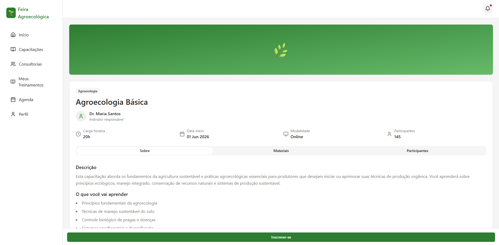
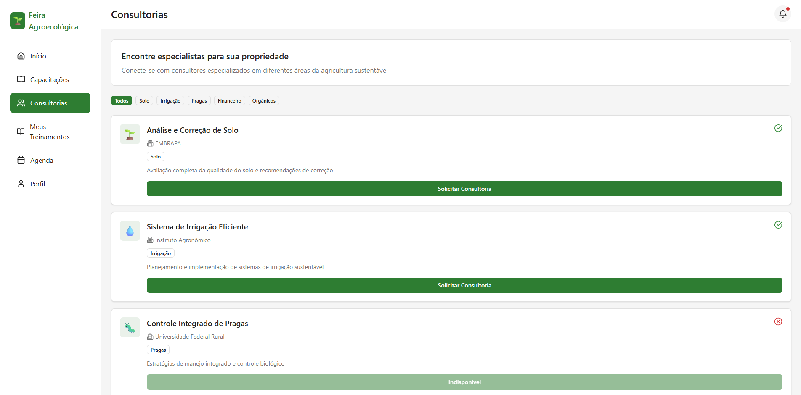
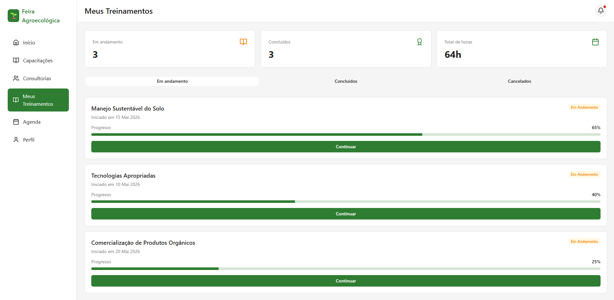
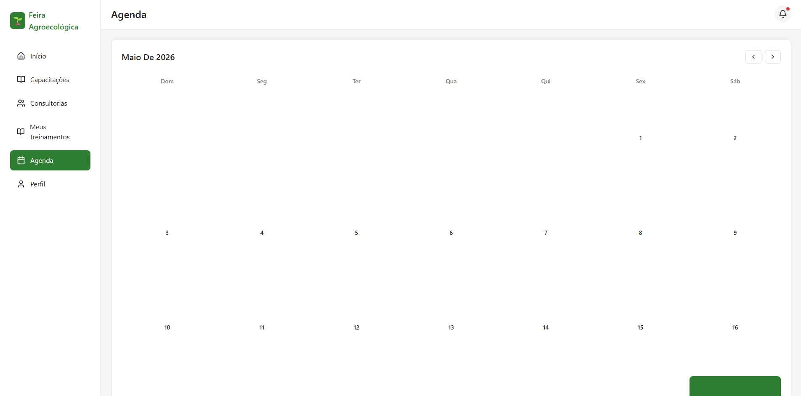
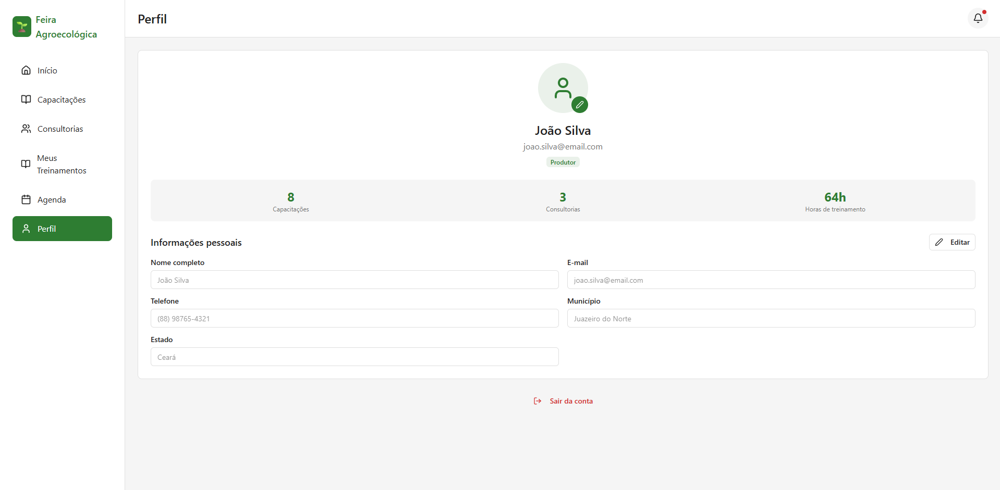

# 🌱 Projeto Integrado III — EP1: Protótipo de Alta Fidelidade

> **Sistema de Gestão de Feiras Agroecológicas Locais**  
> Curso de Análise e Desenvolvimento de Sistemas (ADS) — UFCA/CEAD  
> Projeto Integrado III (ADS0038) — Prof. Luís Fabrício de Freitas Souza

---

## 🎨 Protótipo Navegável (Figma)

🔗 **[Acessar protótipo no Figma](https://www.figma.com/design/Ikzoi5h2P2utdvvWbDfaKz/ProjetoIntegrador3?node-id=0-1&t=vYjMJ6uE4YkdTvjr-1)**

---

## 📸 Telas do Protótipo

### Login


### Cadastro


### Dashboard do Produtor


### Capacitações


### Detalhe da Capacitação


### Consultorias


### Meus Treinamentos


### Agenda


### Perfil


---

## ❓ Problema que a solução resolve

Agricultores familiares que participam de feiras agroecológicas enfrentam dificuldades para acessar capacitações técnicas e consultorias especializadas. A comunicação entre produtores e redes de apoio é fragmentada, feita por grupos de WhatsApp e planilhas avulsas, sem registro ou organização centralizada.

O sistema resolve essa lacuna ao reunir em uma única plataforma web: capacitações, consultorias, agendamentos e materiais de apoio — de forma acessível e intuitiva.

---

## 🎯 Objetivo do sistema

Digitalizar e organizar a gestão das feiras agroecológicas locais, conectando três perfis:

- **Produtor** — acessa capacitações, consultorias, agenda e histórico de treinamentos
- **Rede de Apoio** — cria e gerencia capacitações e consultorias oferecidas
- **Administrador** — gerencia o sistema como um todo

---

## ⚙️ Fluxo de navegação

```
Login
 ├── Cadastro
 ├── Recuperar Senha → Validar Código
 └── Dashboard Produtor
      ├── Capacitações → Detalhe da Capacitação
      ├── Consultorias
      ├── Meus Treinamentos
      ├── Agenda
      └── Perfil

Login (Rede de Apoio)
 └── Dashboard Rede de Apoio
      ├── Criar Capacitação
      └── Criar Consultoria
```

---

## 🛠️ Tecnologias utilizadas

| Tecnologia | Uso |
|---|---|
| Figma / Figma Make | Prototipação de alta fidelidade |
| React + TypeScript | Base do protótipo interativo |
| Tailwind CSS | Estilização das interfaces |
| Vite | Bundler do projeto |
| GitHub | Versionamento e documentação |

**Paleta de cores:**
- Verde escuro `#2E7D32` — cor primária
- Verde claro `#66BB6A` — destaque e ações
- Branco `#FFFFFF` — fundo
- Cinza claro `#F5F5F5` — cards e seções

**Tipografia:** Poppins (Google Fonts)

---

## 🎨 Importância da Experiência do Usuário (UX)

A Experiência do Usuário vai além da estética — ela representa como uma pessoa se sente ao interagir com um sistema. No nosso projeto, isso é especialmente importante porque o público principal inclui agricultores familiares, que em muitos casos têm pouca familiaridade com tecnologia digital.

Um sistema com boa UX pode ser a diferença entre uma ferramenta adotada no dia a dia e uma abandonada logo nos primeiros usos. Quando o design é centrado no usuário, ele reduz erros, diminui o tempo de aprendizado e aumenta a confiança das pessoas na tecnologia.

Princípios aplicados no protótipo:

- **Consistência visual** — mesma paleta, tipografia e componentes em todas as telas
- **Hierarquia clara** — títulos, subtítulos e textos com pesos diferentes guiam o olhar
- **Navegação intuitiva** — menu lateral fixo com ícone + label em cada item
- **Feedback visual** — botões com estados hover e active; badges de status coloridos
- **Prevenção de erros** — formulários com validação e mensagens explicativas
- **Acessibilidade** — contraste verificado (WCAG 2.1 nível AA), fontes mínimas de 14px
- **Linguagem simples** — sem jargões técnicos, adequada ao perfil do agricultor familiar

---

## 🌍 Possíveis usos da nossa solução

- **Prefeituras** podem usar o sistema para organizar feiras agroecológicas municipais e monitorar a participação dos produtores
- **Universidades** podem registrar e gerenciar projetos de extensão voltados à assistência técnica rural
- **Cooperativas** podem centralizar comunicação com associados e divulgar treinamentos
- **ONGs** podem sistematizar ações de apoio à agricultura familiar com mais rastreabilidade
- **Produtores** ganham autonomia para acessar capacitações sem depender de canais informais

---

## 📋 Critérios atendidos

| Critério | Status |
|---|---|
| Protótipo de alta fidelidade | ✅ |
| Principais telas e fluxos | ✅ 9 telas |
| Consistência visual | ✅ Design system definido |
| Princípios de UX e usabilidade | ✅ WCAG, Nielsen |
| README com justificativas de design | ✅ |
| Link para o Figma | ✅ |
| Repositório organizado no GitHub | ✅ |

---

## 👥 Equipe

| Nome | Matrícula |
|---|---|
| Arthur Rebouças do Carmo | 2025019454 |
| Sheila Matias Barroso | 2025014897 |
| Rubens Lopes dos Santos | 2025014805 |
| Carlos Rodrigo Ferreira da Silva | 2025014304 |
| Viviana Barros Gomes de Sousa | 2025014912 |
| Samuelson da Silva Lima | 2025014860 |
| Vitoria Cavalcante Souza | 2025019481 |

---

*UFCA — Centro de Educação a Distância (CEAD)*  
*Análise e Desenvolvimento de Sistemas — Projeto Integrado III (ADS0038) — 2026*
